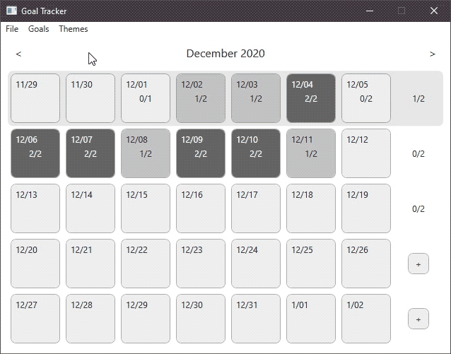
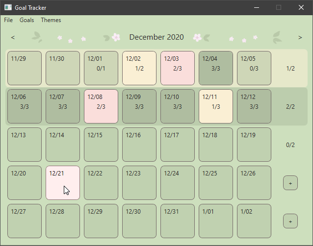
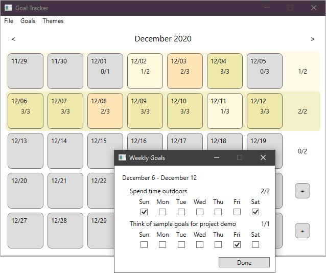
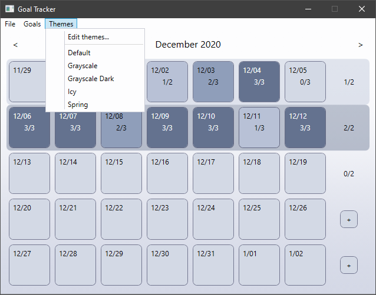
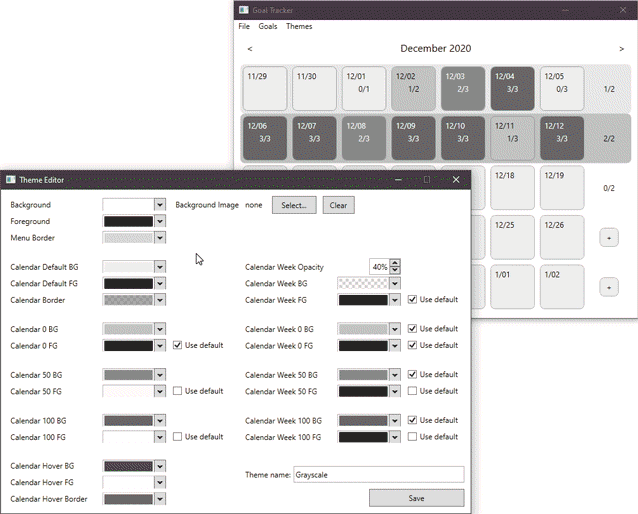

# GoalTracker
GoalTracker helps you keep track of your daily and weekly goals, with a customizable calendar UI to visualize your progress throughout each month.

 

 

## How to run
To run the application (Windows only):
1. Have [.NET Framework Runtime 4.7.2](https://dotnet.microsoft.com/download/dotnet-framework/net472) or later installed on your computer.
2. Download and unzip [the application folder](./portable/GoalTracker.zip) and run `GoalTracker.exe`.
  
  or
1. Clone the GoalTracker repository.
2. Open GoalTracker.sln in Visual Studio 2019 and build the solution.
    - If you see errors about missing packages, you can set up NuGet to automatically download them:
      - Tools menu > Options > NuGet Package Manager > General > Check "Allow NuGet to download missing packages" and "Automatically check for missing packages during build"
      - Tools menu > Options > NuGet Package Manager > Package Sources > Add https://api.nuget.org/v3/index.json as a package source
    
 

## Third-party libraries

Portions of this project make use of the Extended WPF Toolkit by Xceed, provided under the [Xceed Community License agreement](https://github.com/xceedsoftware/wpftoolkit/blob/95104c6105c793f23e85274c24b37dcb744f94db/license.md).

Extended WPF Toolkit is (C) Copyright: Xceed Software, Inc. - 2020. All rights reserved.

